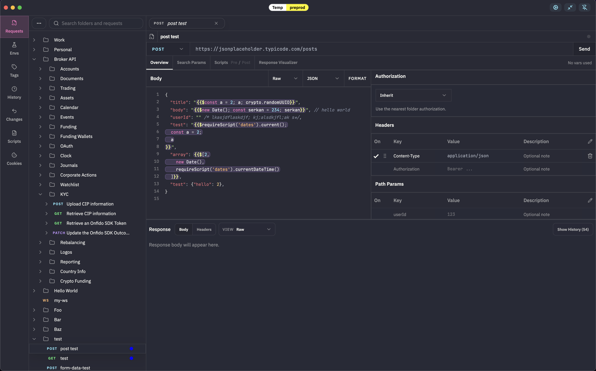

- npm run dev
- npm run build (Build for mac)
- npm run build-mas (Build for Mac App Store)
- xattr -cr /Applications/Kova.app (For your friend to run the built app)

# Features

- REST Client
- SSE, WebSocket, cookies
- Instant navigation
- Recursive folder structure
- Eveything is orderable
- Undo (Deletes and movements)
- Multiple active environments
- Rich extendible script runtime (Prerequest, Postrequest, Response Visualizer, Global, Module)
- Response visualizer with react runtime
- Multiple databases For different workspaces
- Import and export
- Everything is local
- Request history
- Save example requests/responses
- Export as curl, fetch. Import from curl
- opencode integration

## Niche Features

- Vim movements in editor bodies
- Ask before request based on environment
- Colored environments for easily distinguishing
- Ask for an input from the user while making a request
- Make a different request based on the response
- Full autocomplete and typescript support in script bodies
- Colored tags and shortcuts for easily navigating to them (Option+1, Option+2 ...)
- Write to the clipboard in the scripts
- Zod is included in the script runtime for easy validation
- npm package support
